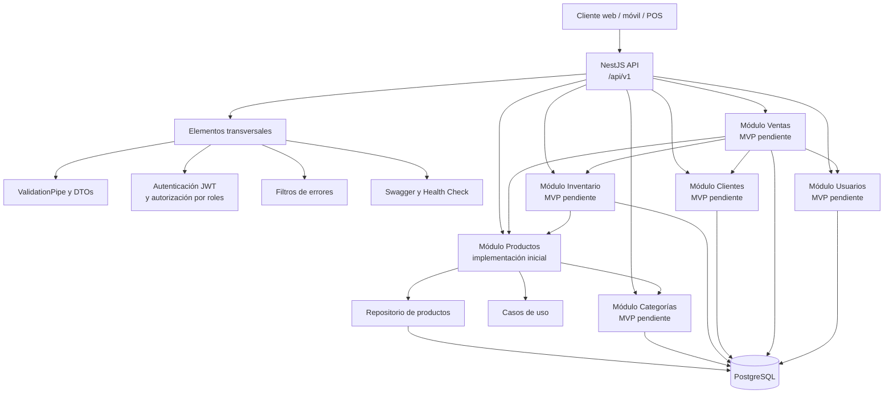
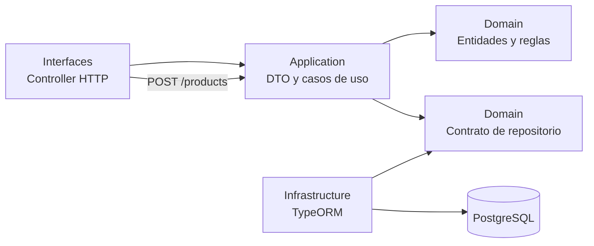
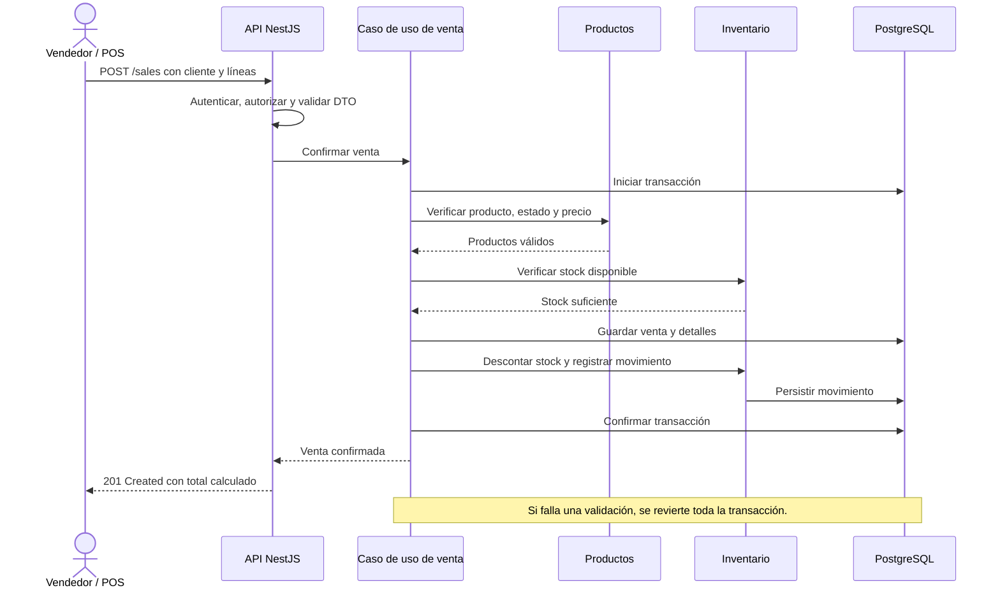
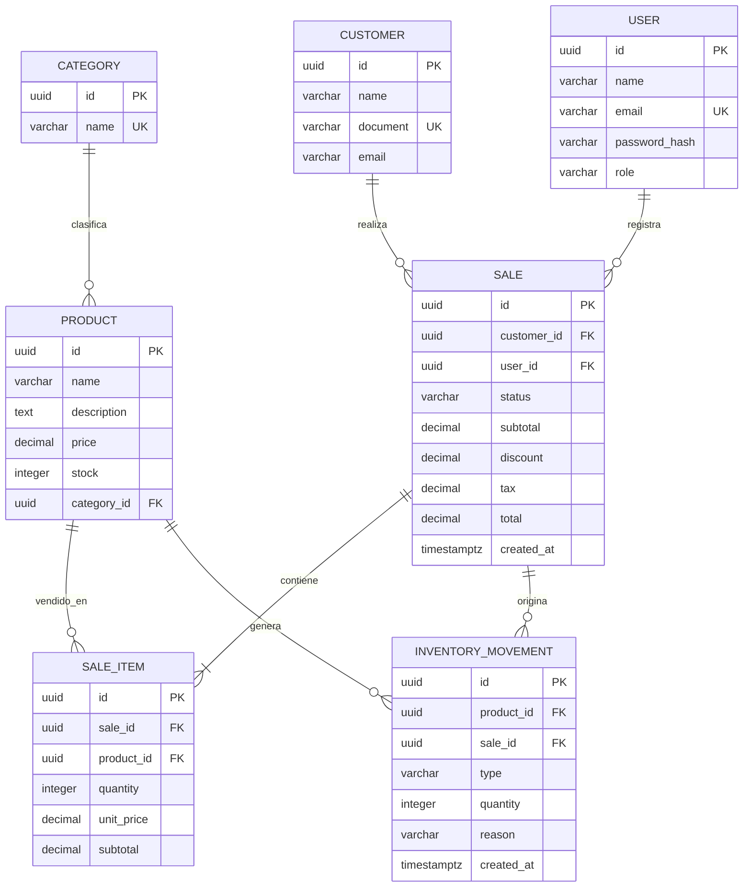

# Diagrama de solución — API de Confitería

> Los bloques marcados como **MVP pendiente** representan los módulos planificados; Productos es el módulo que ya tiene una primera implementación.

## Arquitectura de la API

## Capas dentro de cada módulo

## Flujo seguro de una venta

## Modelo de datos inicial

